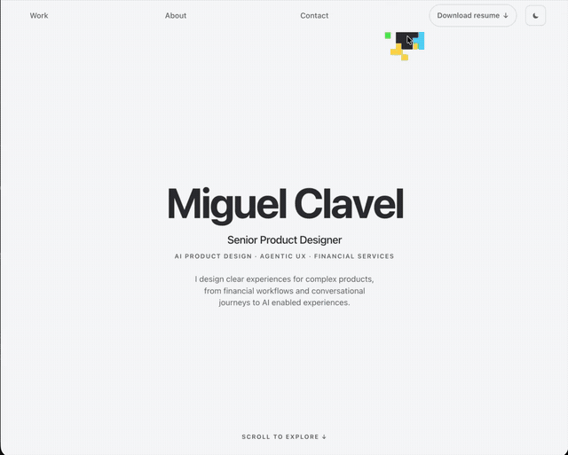
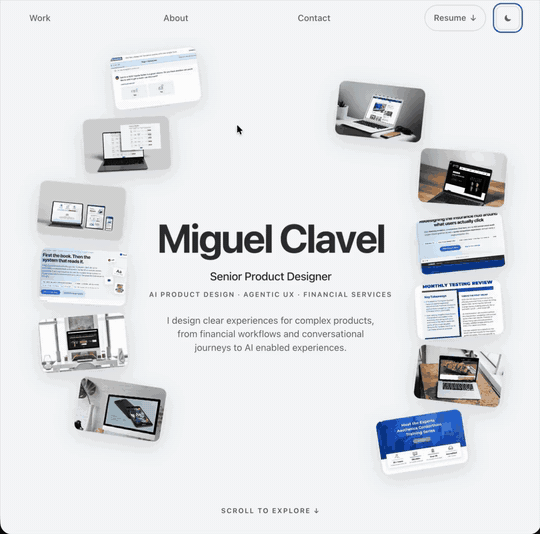

# miguelclavel.com

**[miguelclavel.com](https://miguelclavel.com/?utm_source=github&utm_medium=site-repo)** · My portfolio, rebuilt from the ground up working side by side with Claude.

One long scroll: my name, the work, the background, the tools I actually use, and a small game at the bottom for anyone who gets that far. Twelve case studies, from a car insurance quote rebuilt as a conversation to the digital relaunch of HEAT.com.

## The small moments

A page can be completely correct and still feel flat. These are the moments where it notices you're there. Each one is written up with the exact prompt to build your own:

| | |
| --- | --- |
| [A name where every letter reacts on its own](https://github.com/miguelclavel/name-hover) | [A pixel trail behind the hero](https://github.com/miguelclavel/pixel-trail) |
| [A line that bends toward your cursor](https://github.com/miguelclavel/wave-line) | [A name that travels into the header](https://github.com/miguelclavel/interaction-recipes/tree/main/04-scroll-into-header) |
| [Screenshots that fly in from both sides](https://github.com/miguelclavel/interaction-recipes/tree/main/05-cards-from-sides) | [Images that turn into the frame for the text](https://github.com/miguelclavel/interaction-recipes/tree/main/06-images-frame-text) |
| [A pixel dissolve from light into dark](https://github.com/miguelclavel/interaction-recipes/tree/main/07-pixel-dissolve) | [A playable game in the footer](https://github.com/miguelclavel/pixel-run-game) |
| [Case studies that ride a curve](https://github.com/miguelclavel/interaction-recipes/tree/main/09-case-study-carousel) | [A text selection colour that belongs to the brand](https://github.com/miguelclavel/interaction-recipes/tree/main/10-selection-colour) |
| [A dark mode that remembers you](https://github.com/miguelclavel/interaction-recipes/tree/main/13-dark-light) | [The short version at the top of every case study](https://github.com/miguelclavel/interaction-recipes/tree/main/12-short-version) |

## Three things broke, and none of them were design

1. **My host ran out of build credits in the middle of launch week.** Every deploy came back skipped. So we moved the whole site to a new host in an afternoon, domain and all.
2. **The first deploy on the new host uploaded everything in the folder, git history included.** Anyone could have read every version of the site. I caught it, changed the deploy so it only copies the site itself, and checked the old address gives you nothing now.
3. **A caching rule I thought was helping froze my own code in people's browsers for a year.** I'd ship a fix and it never reached anyone who had already visited.

None of that is design work. All of it decides whether the design work ever gets seen. Two more fixes from the same site, with prompts: [an animation that worked hard to change nothing](https://github.com/miguelclavel/interaction-recipes/tree/main/18-scroll-performance-audit) and [a page that kept requesting a file called {{g.src}}](https://github.com/miguelclavel/interaction-recipes/tree/main/19-404-template-hole).

## How it's made

- Designed by me, built with **Claude Code**
- A static site on **Cloudflare Workers**, deployed from a clean copy so only the site itself is ever uploaded
- Light and dark mode that follows your system and remembers your choice
- Visitor analytics kept small on purpose, with a [privacy page](https://miguelclavel.com/privacy?utm_source=github&utm_medium=site-repo)
- An `llms.txt` so AI assistants can read a plain summary of the work

The source stays private. Its sister site, a portfolio you can talk to, is at [chat.miguelclavel.com](https://github.com/miguelclavel/chat-portfolio).

---

By [Miguel Clavel](https://github.com/miguelclavel), Senior Product Designer. Work is shown for portfolio purposes and was produced during my employment with the companies named. Confidential material has been omitted or altered.
